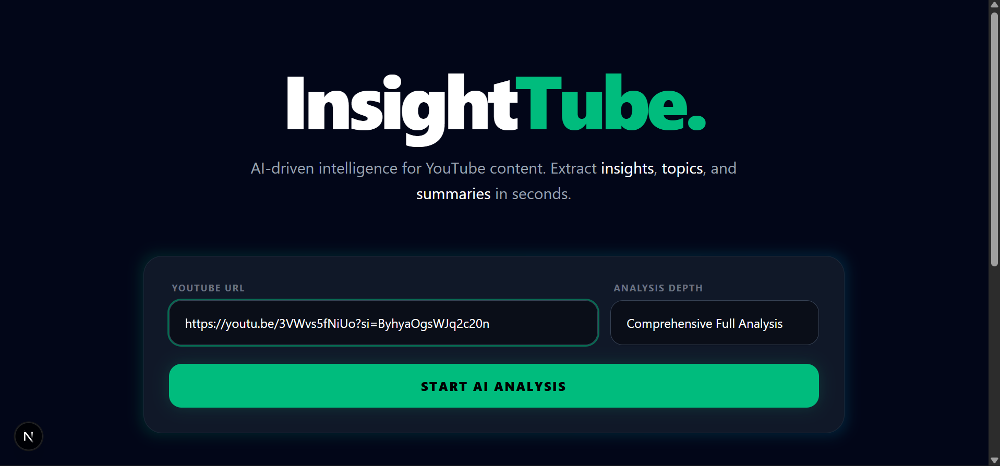
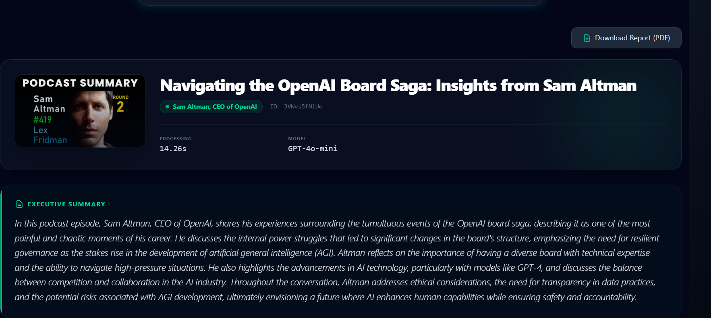
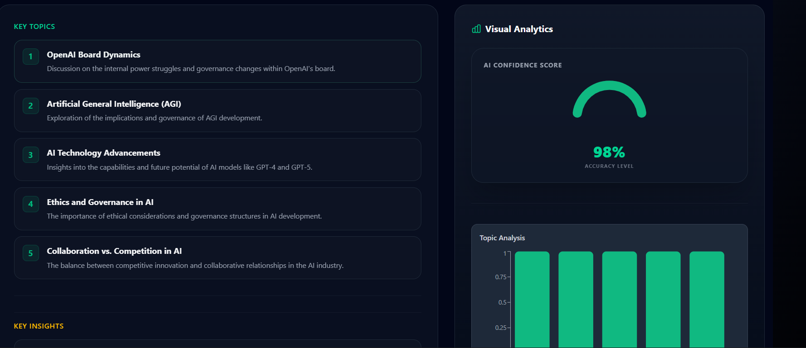
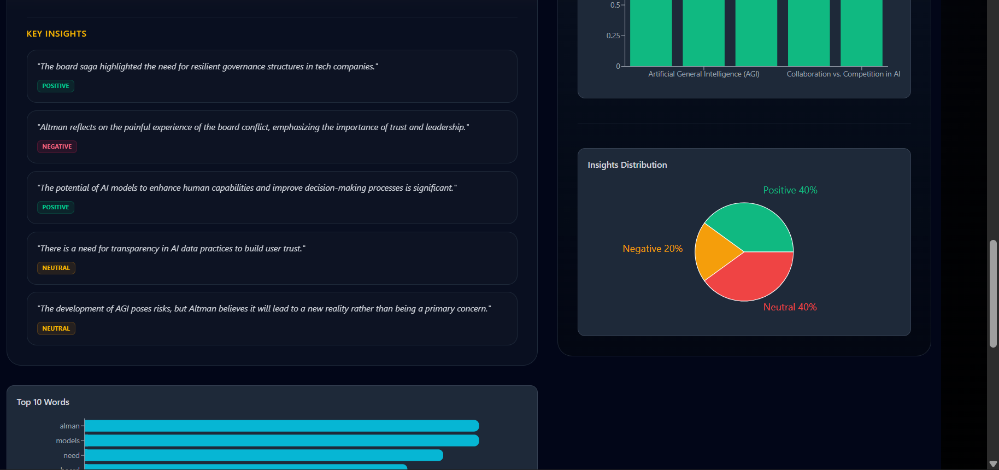

# YouTube Video Analyzer (Backend)







## Introduction

YouTube Video Analyzer is a robust backend service built with FastAPI and LangChain that leverages Large Language Models (LLMs) to transform YouTube video transcripts into structured, actionable insights. By processing video content asynchronously, the service extracts key topics, generates semantic analyses, identifies critical moments with timestamps, and optimizes metadata for enhanced content understanding and accessibility.

## Key Features

- **Asynchronous Transcript Retrieval**: Utilizes LangChain's YoutubeLoader to fetch video transcripts efficiently without blocking operations.
- **Semantic Analysis**: Performs in-depth topic and insight extraction from transcripts using advanced LLM capabilities.
- **AI-Generated Key Moments**: Identifies and timestamps significant moments in the video content for quick navigation and reference.
- **Metadata Optimization**: Employs LLM-driven fallbacks to enhance video titles and author information when needed.
- **Structured Data Output**: Leverages Pydantic models and OpenAI's `with_structured_output` for consistent, type-safe API responses.

## Tech Stack

- **FastAPI**: High-performance web framework for building APIs with automatic interactive documentation.
- **LangChain**: Framework for developing applications powered by language models.
- **OpenAI (GPT-4o-mini)**: Lightweight GPT-4 model for efficient LLM processing.
- **Pydantic**: Data validation and serialization library for Python.
- **Uvicorn**: ASGI server for running FastAPI applications.

## Installation Guide

1. **Clone the Repository**:
   ```bash
   git clone <repository-url>
   cd yt_video_analyzer
   ```

2. **Install Dependencies**:
   ```bash
   pip install -r requirements.txt
   ```

3. **Environment Setup**:
   - Create a `.env` file in the root directory.
   - Add your OpenAI API key:
     ```
     OPENAI_API_KEY=your_openai_api_key_here
     ```

4. **Run the Application**:
   ```bash
   uvicorn main:app --reload
   ```

   The API will be available at `http://localhost:8000` with interactive documentation at `http://localhost:8000/docs`.

## API Endpoints

- **POST /analyze**: Main analysis endpoint that accepts a YouTube video URL and returns structured insights including topics, summary, key moments, and optimized metadata.
